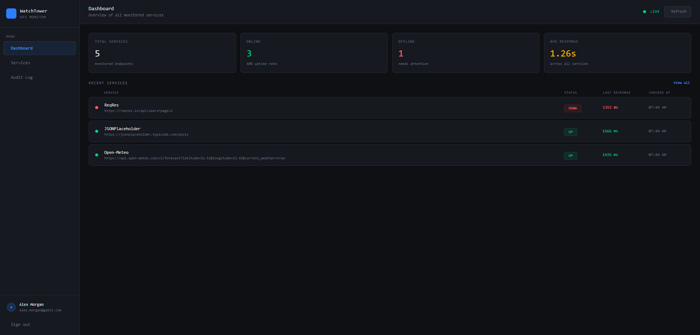
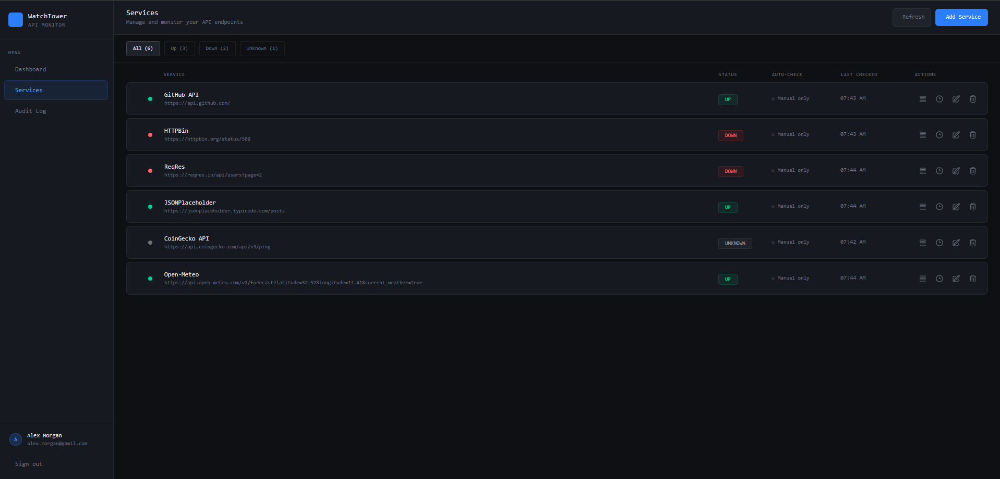
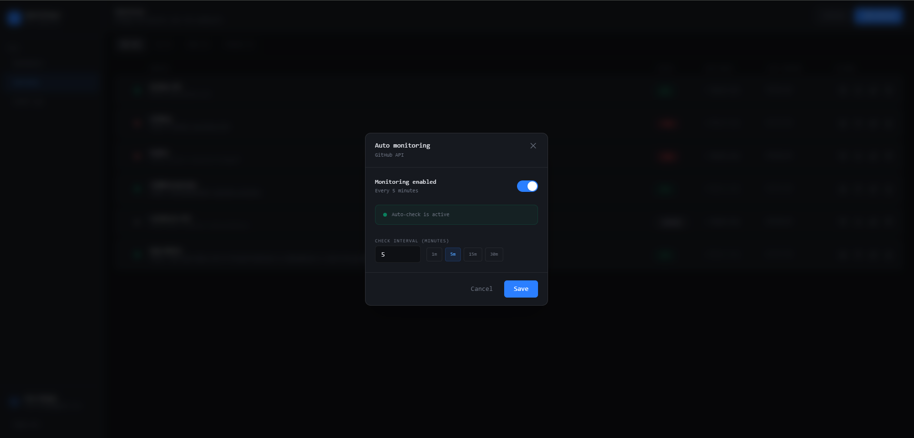
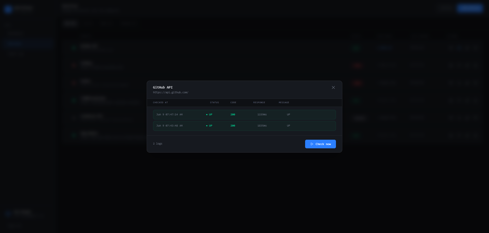
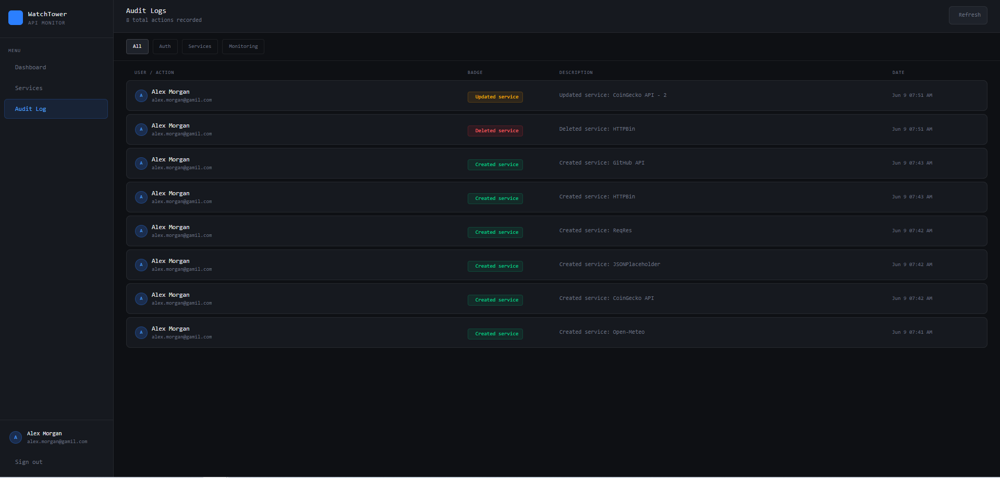

# WatchTower — Full Stack API Monitoring System

Production-ready API monitoring platform with real-time health checks, audit trails, and multi-user isolation.

---

## Overview

WatchTower is a full-stack application designed to monitor external API endpoints with automated and manual health checks. It provides complete visibility into service availability, performance, and user actions.

### Core Capabilities
- Real-time monitoring of external APIs (UP / DOWN / SLOW / UNKNOWN)
- Configurable auto-check scheduling per service
- Comprehensive audit trail with pagination
- Paginated health check history per service
- JWT authentication with session persistence
- Correlation ID request tracing
- Role-based data isolation (each user sees only their services)

---


---

## Screenshots

### Dashboard Overview


### Services Management


### Health Check Setting


### Health Check Logs


### Audit Trail


---

## Tech Stack

### Backend
- Java 21
- Spring Boot 3.3+
- Spring Security + JWT
- PostgreSQL + Flyway Migrations
- Spring Data JPA + Hibernate
- Spring Boot Actuator + Correlation ID + Structured Logging
- Maven

### Frontend
- React 19 + TypeScript
- Vite
- Tailwind CSS v4
- Zustand v5
- Axios (with interceptors)
- React Router v7

### DevOps
- Docker + Docker Compose
- Multi-stage builds
- nginx (frontend) + Spring Boot (backend)

---

## Architecture

Loading ...
<!-- 
### Backend Architecture
com.example.backend/
├── security/
├── features/
│ ├── monitoring/
│ ├── HealthCheckLog/
│ ├── audit/
│ └── dashboard/
├── shared/
│ ├── api/
│ ├── helpers/
│ └── exception/
├── config/
└── utils/ -->


### Key Design Principles
- Multi-tenancy (user-scoped data)
- Ownership enforcement via `findByIdAndUser()`
- Audit logging for all mutations
- Correlation ID tracing per request
- Consistent pagination (`Page<T>` responses)

---

## Security

- JWT authentication (24h–7d expiration)
- Stateless security filter chain
- Data isolation per authenticated user
- BCrypt password hashing
- CORS configured for frontend
- Correlation ID + MDC logging

---

## Database & Migrations

- PostgreSQL
- Flyway migrations
- `ddl-auto: none`
- Versioned schema files:
  - `V1__initial_schema.sql`
  - etc.

Tables:
- users
- monitoring
- healthcheck
- audit_logs

---

## Major Features & Endpoints

### Authentication
- `POST /api/auth/register`
- `POST /api/auth/login`
- `GET /api/auth/me`

### Services
- `GET /api/service?page=0&size=10`
- `POST /api/service`
- `PUT /api/service/{id}`
- `DELETE /api/service/{id}`
- `POST /api/service/{id}/check`
- `PUT /api/service/{id}/autocheck`

### Health Checks
- `GET /api/health/service/{serviceId}?page=0&size=20`

### Audit Logs
- `GET /api/audit?page=0&size=15`

### Dashboard
- `GET /api/service/dashboard/metrics`

---

## Observability & Logging

- Correlation ID (`X-Correlation-Id`)
- Structured logging with MDC
- Request logging (duration, status, method)
- Spring Actuator endpoints:
  - `/actuator/health`
  - `/actuator/metrics`
- Global exception handler with consistent error format

---

## Docker Setup

Includes:
- Backend (Spring Boot)
- Frontend (React + nginx)
- PostgreSQL database
- Automatic migrations (Flyway)

---

## Running Locally with Docker

```bash
git clone https://github.com/Morel-D/API-monitoring-system.git
cd API-monitoring-system
cp .env.example .env  # fill in local Postgres credentials
docker compose up --build
```

Access:
- Frontend: `http://localhost:8080`
- Backend: `http://localhost:8081`
- Database: `localhost:5432`

---

## Development Practices

- Feature-based architecture
- Strict ownership validation
- Audit logging for all actions
- Consistent pagination
- Centralized error handling
- Explicit entity design (no overuse of `@Data`)

---

## Live Deployment

| Layer | Platform | Notes |
|---|---|---|
| Frontend | [Vercel](https://vercel.com) | Static SPA, global CDN, zero downtime |
| Backend | [Render](https://render.com) | Dockerized Spring Boot, free tier (sleeps after 15min idle) |
| Database | [Neon](https://neon.tech) | Serverless PostgreSQL, scale-to-zero |
| Uptime monitoring | [UptimeRobot](https://uptimerobot.com) | 5-min health pings to reduce cold starts |
<!-- | CI/CD | GitHub Actions | Automated build + test on every push | -->

**Note on cold starts**: The backend spins down after ~15 minutes of inactivity on Render's free tier, so the first request afterward can take ~30–50s. Rather than masking this with a keepalive ping — which burns through free-tier usage hours and edges toward violating fair-use terms — the frontend surfaces a "waking up the server" notice on cold start instead. See [Architecture Decisions](#architecture-decisions) for the reasoning behind running this on free infrastructure.

### Production debugging highlights
Real issues encountered and resolved during deployment — not theoretical:
- Diagnosed a config file shadowing bug where Maven's actual config path (`src/main/resources/`) differed from a decoy root-level file, causing silent schema failures in production
- Resolved a CORS preflight failure caused by duplicate, conflicting `CorsConfigurationSource` beans — consolidated into a single source of truth inside the Spring Security filter chain
- Fixed an axios interceptor bug that force-redirected on any 401, including failed login attempts themselves, wiping error state before users could read it
- Tuned JVM heap (`-Xmx400m`) to fit Render's free-tier 512MB memory constraint

---

## Summary

WatchTower is designed for production readiness with strong emphasis on:
- Observability
- Security
- Multi-user isolation
- Maintainability